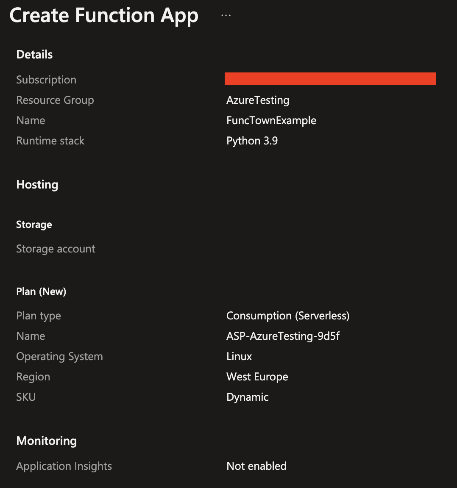
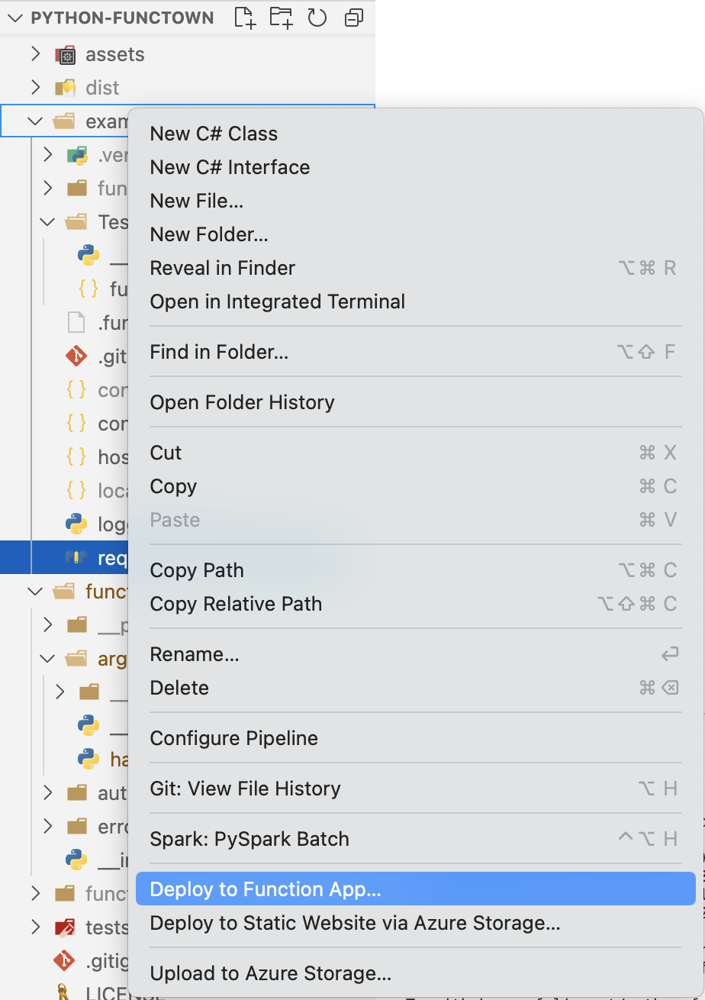
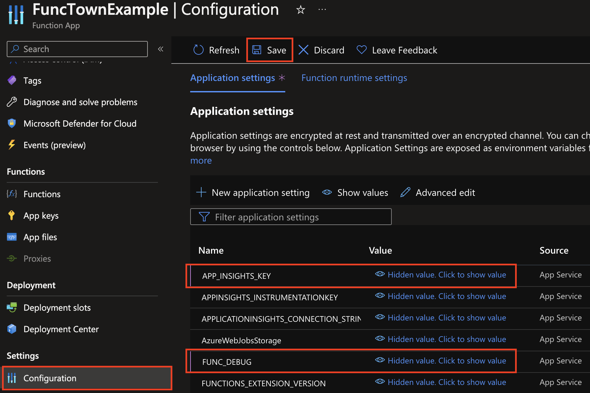
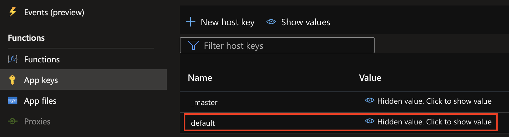

# 🎷 FuncTown 🎷

`FuncTown` is a python library to make working with azure functions easier and remove boilerplate.

## Getting Started

```bash
pip install functown
```

After installing you can easily get your functions error checked (with an auto-response for execptions triggered):

```python
from functown import handle_errors

@handle_errors(debug=True)
def main(req: func.HttpRequest) -> func.HttpResponse:
    logging.info('Python HTTP trigger function processed a request.')

    # ...

    return func.HttpResponse("success", status_code=200)
```

Should an exception happening in the middle, the decorator will auto-parse it (and write to logs if debug is true), then provide a response.

You can also parse JWT tokens and validate them (this currently requires to set the `B2C_ISSUER_URL` and `B2C_APP_ID` environment variables):

```python
from functown.auth import verify_user

def main(req: func.HttpRequest) -> func.HttpResponse:
    user, user_id, user_scp, local = verify_user(req, scope=scopes.SCOPE_WRITE)
```

Finally the library also allows you to easily parse arguments coming from the `HttpRequest`:

```python
from functown import RequestArgHandler

def main(req: func.HttpRequest) -> func.HttpResponse:
    args = RequestArgHandler(req)
    data = args.get_body_query("data_name", required=True, allowed=["foo", "bar"])
    switch = args.get_body("bool_name", map_fct='bool')
    file = args.get_file('file_name', required=True)
```

All this should remove boilerplate from Azure-Functions.

🎷 Welcome to FuncTown! 🎷

## Decorators

Most of the functionality that `FuncTown` provides is through decorators.
These decorators can be used to wrap your functions and provide additional functionality.

Note that almost all decorators pass along additional arguments to your function.
So it is generally a good idea to modify your function signature to accept these arguments:

```python
# instead of main(req: func.HttpRequest) -> func.HttpResponse:
def main(req: func.HttpRequest, *params, **kwargs) -> func.HttpResponse:
    # ...
```

> **Note:** The `last_decorator` parameter is used to indicate that this is the last decorator in the chain.
> This makes sure that the signature of the function is consumable by Azure Functions.
> Alternatively you can also the the `@functown.clean` decorator to clean up the signature.

### `handle_errors`

The `handle_errors` decorator can be used to wrap your function and provide error handling.
It will catch any exception that is thrown in the function and provide a response to the user.

```python
from functown import handle_errors

@handle_errors(debug=True, last_decorator=True)
def main(req: func.HttpRequest, *params, **kwargs) -> func.HttpResponse:
    logging.info('Python HTTP trigger function processed a request.')

    # ...

    return func.HttpResponse("success", status_code=200)
```

You can also specify the degree to which debug information is returned as part of the response
with the following parameters:

* `debug` (bool): Defines if general exceptions are written to the logs with stack trace (default: `False`)
* `log_all_errors` (bool): Defines if all exceptions are written to the logs with stack trace (including errors that might explicitly contain user data such as `TokenError`) (default: `False`)
* `return_errors` (bool): Defines if the error message is returned as part of the response (for quicker debugging) (default: `False`)

### `metrics_all`

The `metrics_all` decorator can be used to wrap your function and provide logging of metrics in Application Insights.
This includes 4 major categories:

* `enable_logger`: Enables sending of general `Trace` data to Application Insights through the use of a `logger` object passed to the function (of type `logging.Logger`)
* `enable_events`: Enables sending of `CustomEvent` data to Application Insights through the use of a `events` object passed to the function (of type `logging.logger`)
* `enable_tracer`: Enables sending of `Request` data to Application Insights through the use of a `tracer` object passed to the function (of type `opencensus.trace.tracer.Tracer`)
FIXME: update metrics here
* `enable_metrics`: Enables sending of `Metric` data to Application Insights through the use of a `metrics` object passed to the function (of type `opencensus.stats.stats.Stats`)

Note that each of these elements has additional sub-parameters that can be set.

#### logger

```python
from functown import metrics_logger
from logging import Logger

@metrics_logger(enable_logger=True, last_decorator=True)
def main(req: func.HttpRequest, logger: Logger, *params, **kwargs) -> func.HttpResponse:
    logger.info('Python HTTP trigger function processed a request.')

    # ...

    return func.HttpResponse("success", status_code=200)
```

#### events

```python
from functown import metrics_events
from logging import Logger

@metrics_events(enable_events=True, last_decorator=True)
def main(req: func.HttpRequest, events: Logger, *params, **kwargs) -> func.HttpResponse:
    # log event
    events.info('Custom Event', extra={'custom_dimensions': {'foo': 'bar'}})

    # ...

    return func.HttpResponse("success", status_code=200)
```

#### tracer

```python
from functown import metrics_tracer
from opencensus.trace.tracer import Tracer

@metrics_tracer(enable_tracer=True, tracer_sample=1.0, last_decorator=True)
def main(req: func.HttpRequest, tracer: Tracer, *params, **kwargs) -> func.HttpResponse:
    # start span
    with tracer.span(name="span_name") as span:
        # everything in this block will be part of the span (and send sampled to Application Insights)
        # ...

    # ...

    return func.HttpResponse("success", status_code=200)
```

#### metrics

```python
from functown import log_metrics
# FIXME: implement
```

## Versioning

We use [SemVer](http://semver.org/) for versioning. For the versions available, see the tags on this repository.

## Run Example

The source folder also includes an `example` function that provides a basic azure function,
that leverages the different functionality of the library.

You can create a new Functions app in your Azure Subscripton to test it. Follow these steps:

1. Login to your Azure Portal in the browser
2. Create a new Functions App (note that this should at least be Python 3.8 and a consumption tier is recommended)
    
3. Publish the content of the example folder to the functions app (through VS Code Plug-In or through CLI) - I usually use VSCode directly:
    
4. Create a new Application Insights Instance through your Browser in the same resource group as the Functions App
    * Note: Check here - sometimes this instance is already created directly with your Function App
5. Take the `instrumentation key` from the App Insights (found in overview blade) and copy it
6. Go to the Function App in Azure and to the Configuration Blade. There create the config settings specified in `example/config.tmp.json` (use the copied App Insights Instrumentation Key here)
    
7. To run the curl commands (you could also test by going on the `TestFuncTown` Example function in your browser) we need a function app key (found under the `App Keys` blade):
    

You can now use `curl` to test various commands against the endpoint:

```bash
# Write a list of curl commands to test the different functionality of the example function

# set the name of your function app (e.g. functownexample) and the key
# note that the function app name might vary and you can find it on the overview blade of your function app
FAPP="functownexample"
FAPP_KEY="YOUR_APP_KEY"

# test the basic functionality
curl -X POST -H "Content-Type: application/json" -d '{"print_num": "2", "req": "some req param"}' "https://${FAPP}.azurewebsites.net/api/TestFuncTown?code=${FAPP_KEY}"
# Expected output:
# {
#   "completed": true,
#   "results": {
#     "body_param": "no body param",
#     "query_param": "no query param",
#     "use_exeption": null,
#     "print_num": 2,
#     "print_list": null,
#     "req_param": "some req param"
#   },
#   "logs": [
#     "Using functown v0.1.7",
#     "body_param: no body param",
#     "query_param: no query param",
#     "use_exeption: None",
#     "print_num: 2",
#     "print_num: 0",
#     "print_num: 1",
#     "print_list: None",
#     "req_param: some req param"
#   ]
# }

# you can also test throwing an exception:
curl -X POST -H "Content-Type: application/json" -d '{"use_exeption": "true"}' "https://${FAPP}.azurewebsites.net/api/TestFuncTown?code=${FAPP_KEY}"
# Expected output:
# {
#   "user_message": "This function executed unsuccessfully",
#   "type": "<class 'TypeError'>",
#   "value": "'str' object cannot be interpreted as an integer",
#   "trace": [
#     "error_decorator.py:79:111 - Vars: ('req', 'ex')",
#     "__init__.py:22:54 - Vars: ('req', 'logger', 'logs', 'args', 'body_param', 'query_param', 'use_exeption', 'print_num', 'i', 'print_list', 'req_param', 'payload')"
#   ]
# }

# some further curl commands to try:
curl -X POST -H "Content-Type: application/json" -d '{"print_num": "2", "print_list": ["a", "b", "c"]}' "https://${FAPP}.azurewebsites.net/api/TestFuncTown?code=${FAPP_KEY}"
curl -X POST -H "Content-Type: application/json" -d '{"body_param": "some body param", "query_param": "some query param", "req": "required"}' "https://${FAPP}.azurewebsites.net/api/TestFuncTown?code=${FAPP_KEY}"
```

> ⛔ **Note:** ️Think about shutting down your azure resources after you used them to avoid additional costs! ⛔️
>
> (esp. when using a non-consumption tier)

**Note on App Insights:** Metrics and traces take a time to show up in the App Insights. You can also use the `logs` field in the response to see the logs of the function.

### Testing functown Code

This function also allows to test changes to functown in the development process.
For that simply copy the current `functown` folder into the `example` folder and rename it to `functown_local`, then redeploy the function app.

You should also update the version number in the `__init__.py` file of the `functown` folder before (which needs to be done for any changes, see section on `Versioning`).

> **Note:** When you update dependencies you also need to temporarily add these dependencies to the `requirements.txt` file in the `example` folder (and remove them before commiting!).

You can verify that the new version of the code was picked up by the first log statement in your return.

## Notes

* The `@handle_error` decorator returns additional information to be used in the development process. This can also expose infrormation to attackers, so use responsibly (i.e. make sure to disable for production environments).

If you want to develop on the library or execute tests, you can install the conda environment:

```bash
# remove old:
# conda env remove -n functown
conda env create -f conda-dev.yml
conda activate functown
```

> ‼️ If you find this library helpful or have suggestions please let me know.
Also any contributions are welcome! ‼️
