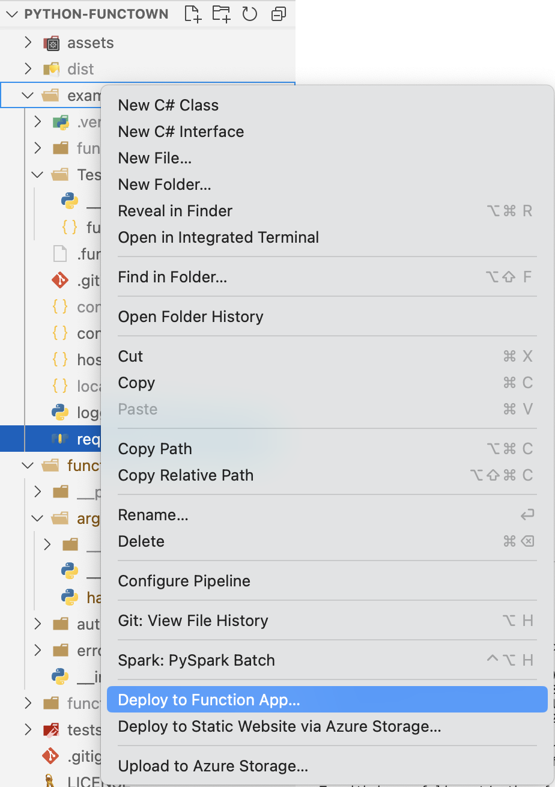

# FuncTown Development Guide

This guide is intended for developers who want to contribute to the development of
`FuncTown`.

## Setup

The repository contains a `conda-dev.yml` file which can be used to create a conda
environment that should contain all relevant dependencies.

```bash
# remove old:
# conda env remove -n functown
conda env create -f conda-dev.yml
conda activate functown
```

## Versioning

We use [SemVer](http://semver.org/) for versioning. For the versions available, see the
tags on this repository.

## Development

If you want to help out in the library development, a good place to start is the
[issues](https://github.com/felixnext/python-functown/issues) page. There you can find
ideas for new features or bugs that need to be fixed.

## Testing

The system contains two parts of tests: unit tests and integration tests.

### Unit Tests

Unit tests are located in the `tests` folder and can be executed with `pytest`. It is
recommended to use the `--forked` option from `pytest-forked` to avoid side effects.

```bash
pytest --forked
```

These unit-tests are executed on every merge, so make sure to run them before pushing.

### Integration Tests

Integration tests are done directly in a function app. To run them, you need to create
a function app in Azure and deploy the `example` folder to it.

#### Setting up the Function App

The source folder also includes an `example` function that provides a basic azure function,
that leverages the different functionality of the library.

You can create a new Functions app in your Azure Subscripton to test it. Follow these steps:

1. Login to your Azure Portal in the browser
2. Create a new Functions App (note that this should at least be Python 3.8 and a consumption tier is recommended)
    
3. Publish the content of the example folder to the functions app (through VS Code Plug-In or through CLI) - I usually use VSCode directly:
    
4. Create a new Application Insights Instance through your Browser in the same resource group as the Functions App
    * Note: Check here - sometimes this instance is already created directly with your Function App
5. Take the `instrumentation key` from the App Insights (found in overview blade) and copy it
6. Go to the Function App in Azure and to the Configuration Blade. There create the config settings specified in `example/config.tmp.json` (use the copied App Insights Instrumentation Key here)
    
7. To run the curl commands (you could also test by going on the `TestFuncTown` Example function in your browser) we need a function app key (found under the `App Keys` blade):
    

You can now use `curl` to test various commands against the endpoint:

```bash
# set the key variables
FAPP="functownexample"
FAPP_KEY="YOUR_APP_KEY"

# curl command
curl -X POST -H "Content-Type: application/json" -d '{"print_num": "2", "req": "some req param"}' "https://${FAPP}.azurewebsites.net/api/TestFuncTown?code=${FAPP_KEY}"
# Expected output:
# {
#   "completed": true,
#   "results": {
#     "body_param": "no body param",
#     "query_param": "no query param",
#     "use_exeption": null,
#     "print_num": 2,
#     "print_list": null,
#     "req_param": "some req param"
#   },
#   "logs": [
#     "Using functown v0.1.7",
#     "body_param: no body param",
#     "query_param: no query param",
#     "use_exeption: None",
#     "print_num: 2",
#     "print_num: 0",
#     "print_num: 1",
#     "print_list: None",
#     "req_param: some req param"
#   ]
# }
```

#### Deploying development versions

For that simply copy the current `functown` folder into the `example` folder.
Make sure that you comment out the `functown` reference in the
`example/requirements.txt` and that the remaining requirements are up to date. Then
redeploy the function app.

You should also update the version number in the `__init__.py` file of the `functown`
folder before (which needs to be done for any changes, see section on
[Versioning](#versioning)).

> **Note:** When you update dependencies you also need to temporarily add these
> dependencies to the `requirements.txt` file in the `example` folder (and remove them
> before commiting!).

You can verify that the new version of the code was picked up by the first log statement
in your return.

#### Run integration tests

The script for the integration tests is `example/validation.sh` (there is also a
powershell version, but this is currently untested!).
You can run the tests with:

```bash
./example/validation.sh --key <key> --name <name>
# Example:
# ./example/validation.sh --key 1234 --name functownexample
```

In this case `<key>` is the key from your functions app and `<name>` is the name of
your functions app.

> Optionally you can also provide the `--debug` flag to print the return values of the
> functions.
